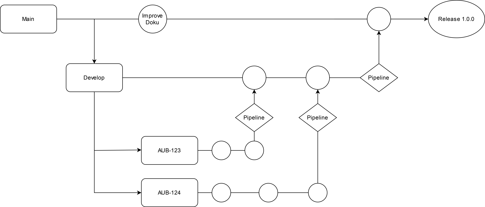
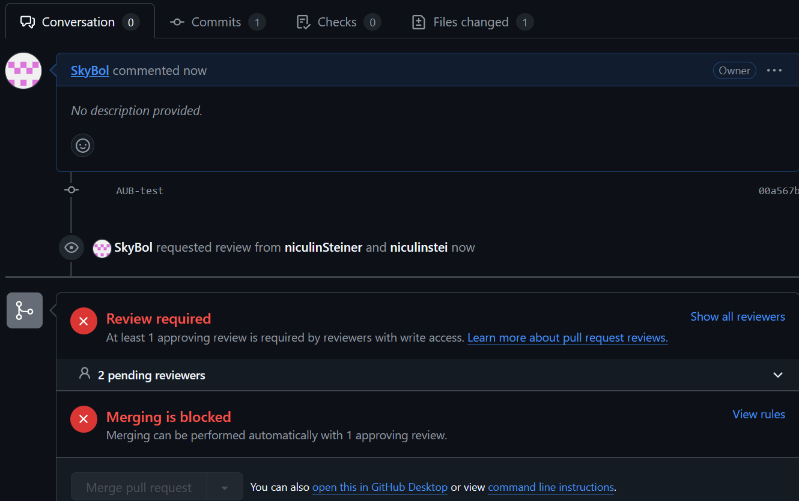

# Branching
Wir verwenden Aufgaben-/Task-Branching. Dies bedeutet das wir für jeden Task einen neuen Branch erstellen werden. Für die Branches wird im Develop einen Pull request erstellt sobald sie bereit fürs mergen sind. Durch diesen Pull request wird dann die CI Pipeline ausgelöst und nach erfolgreichen Tests und bestätigung eines Mitarbeitenden wird dieser dann gemerged. Für Dokumentation / Theorietask werden keine Branches erstellt, es wird direkt auf den Main commited. Ein Branch hat immer den Kürzel AUB- und dann die Nummer des Issues. Also bspw AUB-123. Die Commits werden nach dem selben Schema benannt. Dort folgt einfach noch eine Beschreiung. Bsp: AUB-123: fixed typo.  

# Versioning
Wir werden im Rahmen dieses Moduls auf die Verison 1.0.0 hinarbeiten. Dabei werden nur die 0.x.y Nummern geändert. Dies gibt uns viel Freiheit in der Entwicklung, da alles vor der Version 1.0.0 im Entwicklungszustand ist, und keine Rücksicht in Bezug auf Kunden bzgl. Breaking Changes o.ä genommen werden muss.

# Pull-Requests
Die Pullrequests sehen dann so aus:  
  

Nach der erstellung des Pull requestes, braucht es die Bestätigung von mindestens einem anderen Entwickler bevor man mergen kann.  
Den Pull request zu mergen ist nicht möglich bevor jemand reviewed hat, dies ist in der Pipeline geblockt.

