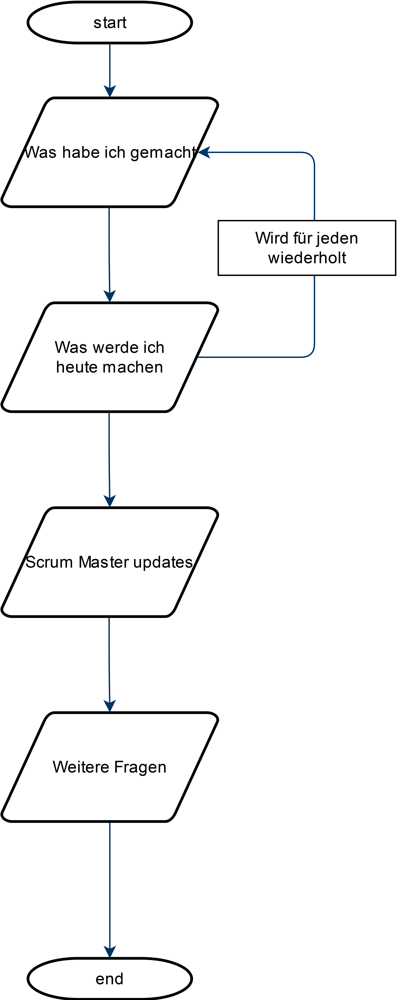
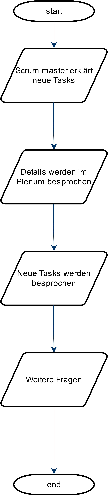

# Meetings
### Daily
Um 8:30 findet jeden Tag ein kurzes Meeting zur Teambesprechung statt.  
Dieses sollte dazu dienen, gegenseitig einen kleinen Überblick zu verschaffen und eine es sollten kurz die nächsten Tasks abgesprochen werden.
Scrum Master in unserem Projekt hat Kian Ganz. Wir haben uns für einen Scrum Master entschieden, da die Meetings so geordneter ablaufen.  

Unser daily sollte so ablaufen:  

### Planning
Um 9:30 beginnt unser Planning. Dort werden neue Issues besprochen und der Zeitaufwand wird geschätzt. Zusätzlich werden jegliche Fragen geklärt.

Unser Planning sollte so ablaufen:  

# Prozesse
In unseren Issues ist eine geschätzte Anzahl an Stunden die gebraucht wird.  
Die Tasks werden sich jeweils selber zugewiesen, sobald man mit dem vorherigen Task fertig ist. 
Bei einem abgeschlossenen Task weist man diesen an einem Mitarbeiter zu.  
Dieser sollte den Task dann reviewen.
Die Tasks werden eigenständig im Kanban verschoben.
