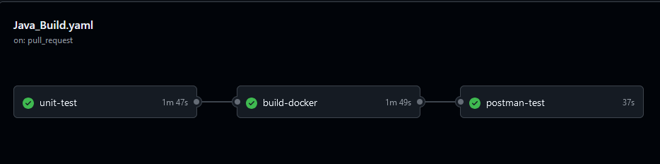

# M324

## Wahl Infrastruktur

### Technologie entscheidung

Code: Java/Spring boot
Datenbank: Postgres

### Git Repository

Github
(https://github.com/SkyBol/M324)

### CI/CD Prozesse
Unsere CI Pipeline über Github actions sieht wie folgt aus  
  

#### Act

Running GitHub Actions locally for testing:
(https://github.com/nektos/act)
act --secret-file act.secrets

### Kanban Board

Github Projects: Kanban
(https://github.com/users/SkyBol/projects/2/views/1)

### Zeit loggen

Die Zeit wird auf einer Excel Tabelle geloggt. Auf der zweiten Tabelle findet man eine Zusammenfassung aller Personen.  
Auf der linken Seite befindet sich die Nummer des jeweiligen Tasks im Backlog. Die 0 steht für Meetings, Planung, Prozesse oder Theorie Inputs.  

https://tbzedu-my.sharepoint.com/:x:/r/personal/sky_bollin_edu_tbz_ch/Documents/TimeTable.xlsx?d=wcd36729904bf4a8ea2dbd48a638975e0&csf=1&web=1&e=0iwwNk

### Dokumentation

Dokumentation im Folder 'Dokumentation' zu finden  
[Dokumentation](Dokumentation/Application-Technology.md)  

### Persönliches Repository

Wird auf Branches in diesem Repo geführt. Diese Branches müssen von den Github Actions ausgeschlossen werden!

# Band und Alben

## Themenblöcke

[Application and Technology](Dokumentation/Application-Technology.md)  
[Branching and Versioning](Dokumentation/Branching-Versioning.md)  
[CI-Concept](Dokumentation/Concept-CI.md)  
[Entity-Relationship Diagrams](Dokumentation/Entity-Relationship-Diagrams.md)  
[Meetings und Prozesse](Dokumentation/Meetings-Prozesse.md)  
