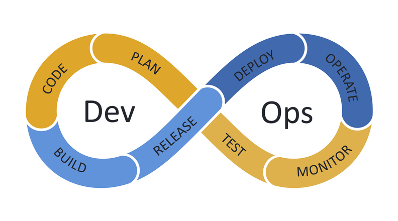

# DevOps Prozesse

## 1. Was ist SDLC (Software Development Life Cycle) und welche Phasen gibt es?

Der Softwareentwicklungszyklus (SDLC) ist ein strukturierter Prozess, der für das Designen, Entwickeln und Testen von Software genutzt wird.
SDLC definiert den gesamten Entwicklungsprozess und unterteilt ihn in mehrere Phasen, um eine effiziente, qualitative und transparente Entwicklung sicherzustellen.

Die Phasen des SDLC sind folgends:

### Planung

Ziel ist es, die Anforderungen zu sammeln und die Machbarkeit des Projekts zu bewerten. Es werden Zeitrahmen, Ressourcen und Budgets definiert.
Ergebnisse: Projektplan, Risikoanalyse.

### Design

Basierend auf den Anforderungen wird die Architektur der Software entworfen. Dies umfasst Datenbankdesign, Interface-Design und Systemarchitektur.
Ergebnisse: Design-Dokumente, Mockups, Diagramme (z. B. UML).

### Implementieren

Der eigentliche Entwicklungsprozess beginnt, bei dem der Code geschrieben wird, basierend auf den zuvor erstellten Design-Dokumenten.
Tools: IDEs wie Visual Studio, IntelliJ IDEA, Code-Repository-Tools wie Git.

### Testen

Die Software wird gründlich auf Fehler, Sicherheitslücken und Leistung geprüft. Tests umfassen Unit-, Integrations-, System- und Akzeptanztests.
Ergebnisse: Fehlerberichte, Testprotokolle.

### Deployment

Nach erfolgreichem Testen wird die Software in der Produktionsumgebung bereitgestellt und für Benutzer zugänglich gemacht.
Es kann in Form von "Soft Launches" oder vollständigen Veröffentlichungen erfolgen.
Ergebnisse: Vollständig betriebsfähige Software.

### Wartung (Maintenance)

Nach der Bereitstellung erfolgt die kontinuierliche Unterstützung der Software durch Fehlerbehebung, Updates und Funktionsverbesserungen.
Ziel: Langlebigkeit und Aktualität der Anwendung.

## 2. Was ist DevOps Lifecycle und welche Phasen gibt es?

Der DevOps Lifecycle beschreibt die kontinuierliche Integration und Zusammenarbeit zwischen Entwicklungs- (Development) und Betriebsteams (Operations). Ziel ist es, die Softwarebereitstellung effizienter, qualitativ hochwertiger und schneller zu machen, indem Automatisierung und Monitoring über den gesamten Prozess integriert werden.

Die Phasen des DevOps Lifecycles sind:

### Planen

In dieser Phase werden die Anforderungen und Ziele definiert. Teams arbeiten zusammen, um User Stories, Roadmaps und Meilensteine festzulegen.

Tools: Jira, Trello, Azure DevOps.

### Coden

Entwickler schreiben und versionieren den Code basierend auf den Anforderungen. Kollaboration und Code-Reviews sind hier zentral.

Tools: Git, GitHub, GitLab, Bitbucket.

### Builden

Der Quellcode wird kompiliert und in ausführbare Artefakte umgewandelt. Build-Systeme automatisieren diesen Prozess.

Tools: Maven, Gradle, Jenkins.

### Testen

Automatisierte Tests (Unit-, Integrations-, End-to-End-Tests) prüfen die Funktionalität, Sicherheit und Leistung der Software.

Tools: Selenium, JUnit, TestNG, Postman.

### Releasen

Nach erfolgreichem Testen wird die Software auf eine stabile Version vorbereitet, die für den Einsatz bereit ist.

Tools: Jenkins, Bamboo, GitHub Actions.

### Deployen

Die Software wird in die Produktionsumgebung oder eine Zwischenumgebung (Staging) überführt. Dies erfolgt oft automatisiert, um Fehler zu minimieren.

Tools: Kubernetes, Docker, Ansible, AWS CodeDeploy.

### Operieren

Der Betrieb der Anwendung wird überwacht, und sie bleibt für Benutzer zugänglich. Hier stehen Skalierbarkeit, Verfügbarkeit und Stabilität im Vordergrund.

Tools: Docker, Kubernetes, Terraform.

### Monitorieren

Kontinuierliches Monitoring erfasst Leistungsdaten und Fehler, um proaktiv auf Probleme reagieren zu können.

Tools: Prometheus, Grafana, ELK Stack (Elasticsearch, Logstash, Kibana), Datadog.

## 3. Welche Unterschiede gibt es zwischen SDLC und DevOps Lifecycle?

| Merkmal        | SDLC                             | DevOps Lifecycle                      |
| -------------- | -------------------------------- | ------------------------------------- |
| Fokus          | Softwareentwicklung              | Integration von Entwicklung & Betrieb |
| Prozess        | Linear/iterativ                  | Zyklisch & iterativ                   |
| Zusammenarbeit | Abgetrennte Teams                | Enge Zusammenarbeit (Kulturwandel)    |
| Flexibilität   | Gering (in klassischen Modellen) | Hoch (agil & adaptiv)                 |
| Tools          | Entwicklungsorientiert           | Automatisierung & Monitoring          |

Beide Ansätze haben ihre Berechtigung, hängen aber von den spezifischen Projektanforderungen und der Unternehmensstrategie ab.

## 4. Was ist ein MVP und warum ist es wichtig für den DevOps Lifecycle?

Ein Minimum Viable Product (MVP) ist eine frühe Version eines Produkts mit gerade so vielen Funktionen, dass es den grundlegenden Anforderungen der Zielgruppe entspricht. Ziel ist es, möglichst schnell und mit minimalem Aufwand ein funktionierendes Produkt bereitzustellen, um:

- Feedback von Nutzern einzuholen
- Hypothesen über die Marktnachfrage oder Funktionen zu testen
- Risiken und Kosten zu minimieren

Ein MVP ist wichtig für den DevOps Lifecycle, weil es:

- Den Fokus auf das Wesentliche legt
- Schnelles Feedback und kontinuierliche Verbesserung ermöglicht.
- Risiken, Zeit und Kosten minimiert
- Perfekt mit den Prinzipien von Automatisierung, Kollaboration und Zyklizität im DevOps harmoniert

Durch ein MVP können Unternehmen besser auf Kundenbedürfnisse reagieren und gleichzeitig von der Effizienz und Flexibilität des DevOps Lifecycles profitieren.

## Quellen

SDLC:

- https://stackify.com/what-is-sdlc/
- https://aws.amazon.com/what-is/sdlc/#
- https://www.geeksforgeeks.org/software-development-life-cycle-sdlc/

DevOps Lifecycle:

- https://www.geeksforgeeks.org/devops-lifecycle/
- https://www.browserstack.com/guide/devops-lifecycle
- https://www.javatpoint.com/devops-lifecycle
- https://www.atlassian.com/devops

DevOpfs Lifecycle vs SDLC:

- https://www.rapidops.com/blog/sdlc-devops-lifecycle/#:~:text=SDLC%20is%20suited%20for%20projects,needing%20agility%20and%20frequent%20updates.
- https://www.keitaro.com/insights/2023/03/30/devops-versus-sdlc/
- https://octopus.com/blog/devops-versus-sdlc

MVP

- https://asana.com/de/resources/minimum-viable-product
- https://www.materna.de/SharedDocs/Downloads/DE/Portfolio/flyer-mvp-devops-aws.pdf?__blob=publicationFile&v=3
- https://www.scnsoft.de/softwareentwicklung/mvp-entwicklung
