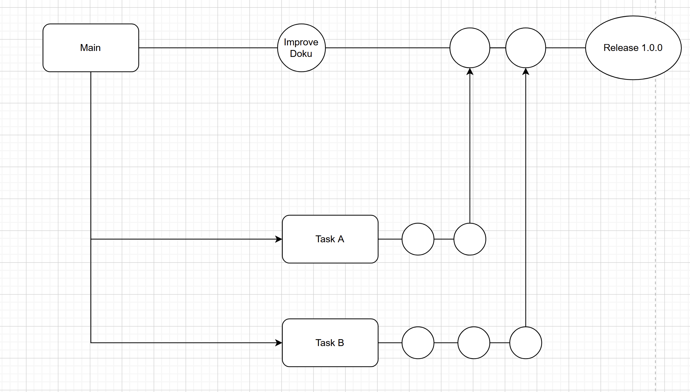

# Continuous Integration
## Was ist Continuous Integration (CI) und wie wird es umgesetzt?
Continuous Integration (nachfolgend CI gennant) wird benutzt um automatisierte und gepflegte Codeänderungen ins Repo hinzuzufügen. Dies hilft bei Konfliktlösungen und um Fehler frühzeitig zu entdecken. Um dies gut umzusetzen braucht man ein Version controll system (VCS) wie zum Beispiel Git. Dazu kommen automatisierte Tests die bei veränderungen sicherstellen, dass der Code auch weiterhin problemlos funktioniert. Wichtig sind auch Pull Requests und Code Reviews um die Codequalität sicherzustellen.
## Was sind die Vor- und Nachteile von CI?
Vorteile: <br>
1. Fehler werden frühzeitig erkannt, da alles automatisch getestet wird. <br>
2. Entwickler können parallel zueinander arbeiten. <br>
3. Die Skalirbarkeit ist deutlich erhöht dadurch, dass die automatisierung von tests die Konflikte minimiert. <br>
Nachteile: <br>
1. Es besteht ein grosser Integrationsaufwand gerade wenn das Team ohne CI-Struktur erstellt wurde <br>
2. Der zusätzliche Schulungsaufwand bedeutet weitere Kosten und Zeit die nicht genutzt werden kann <br>
3. Die Pipeline muss kontinuierlich gewartet und optimiert werden
## Was ist Continuous Testing und wie wird es umgesetzt?
Continuous Testing ist eine Methode, bei der automatisierte Tests regelmäßig und kontinuierlich in jeder Phase der Entwicklung durchgeführt werden. Diese Tests werden automatisch ausgelöst wenn Änderungen am Code gemacht werden. Die Umsetzung wird Beispielsweise mithilfe eines Automatisierten Test-Frameworks wie Selenium oder JUnit umgesetzt die die Erstellung und Durchführung von Beispielsweise Integrationstests oder Funktionstests ermöglicht. Diese Tests werden bei jeder Änderung des Codes durchgeführt. Wichtig ist dabei, dass eine umfassende Testabdeckung besteht um sowohl neue als auch bestehende Funktionen zu überprüfen.
## Was ist eine Branching Strategie und welches sind die bekannten?
Eine Branching-Strategie ist ein systematischer Ansatz, wie Entwickler in Versionskontrollsystemen (z. B. Git) mit Branches arbeiten. Eine Branching Strategie legt fest wie neue Features, Bugfixes und Releases organisiert werden um effizient zu bleiben.
1. Task branching
   Bei Task branching wird für jeden Task einen Branch erstellt basierend auf einem Ticketsystem.
   
   Hier unsere Grafik für unsere eigene Branching Strategie.
2. Git flow
   Bei Git flow werden branches mit spezifischen Branch-typen erstellt. Beispielsweise, main, develop und Feature/.
   Diese Strategie ist sehr geeignet für grössere Teams wegen der klaren Strukturierung.
3. Trunk-based development
   Alle arbeiten direkt auf dem Hauptbranch. Es werden kleine und häufige schritte integriert.
   Dies funktioniert sehr schnell und man vermeidet viele Merge conflicts. Dies erfordert jedoch sehr strenge Disziplin und umfassende Tests.

## Wie kann man Commits und Branches mit User Stories verknüpfen?

Mit Tools wie Jira, Azure DevOps oder Github Projects kann man diese sehr einfach verknüpfen. Normalerweise erkennen diese Tools direkt wenn man den Namen der User Story in einem Commit eingibt und verknüpfen diese so automatisch.

## Welche Merge Strategien gibt es und wie werden sie umgesetzt?
Git bietet verschiedene Merge-Strategien, die je nach Anwendungsfall und Projektanforderungen eingesetzt werden können. Hier ein Überblick über die gängigsten Optionen und ihre Umsetzung:
 
### 1. Recursive (Standardstrategie)
 Diese Strategie wird standardmäßig verwendet, wenn zwei Branches gemergt werden. Sie nutzt einen 3-Wege-Merge, um Änderungen beider Branches zu kombinieren.
 
#### Umsetzung
```
git merge -s recursive branch1 branch2
```
Erkennung und Bearbeitung von Umbenennungen ist möglich.
Konflikte müssen bei Bedarf manuell gelöst werden.
 
### 2. Resolve
Eine vereinfachte Strategie, die ebenfalls einen 3-Wege-Merge nutzt, aber vorsichtig mit Mehrdeutigkeiten umgeht. Sie ist schnell und sicher für einfache Merges.
 
#### Umsetzung
```
git merge -s resolve branch1 branch2
```
 
### 3. Octopus
Wird verwendet, wenn mehr als zwei Branches gleichzeitig gemergt werden. Sie ist ideal für das Zusammenführen ähnlicher Feature-Branches. Konflikte können jedoch nicht automatisch gelöst werden.
 
#### Umsetzung
```
git merge -s octopus branch1 branch2 branch3
```
 
### 4. Ours
Ignoriert Änderungen anderer Branches und behält nur den aktuellen Branch-Inhalt.
 
#### Umsetzung
```
git merge -s ours branch1 branch2
```
 
### 5. Subtree
Wird verwendet, wenn ein Branch eine Unterstruktur eines anderen ist. Die Strategie passt die Baumstruktur während des Merges entsprechend an.
 
#### Umsetzung
```
git merge -s subtree branchA branchB
```
 
### 6. Implicit-Merge (Rebase oder Fast-Forward)
Verändert den Verlauf nicht explizit durch Merge-Commits. Stattdessen wird der Zielbranch "fortgeschrieben".
 
#### Umsetzung
```
git rebase branch
git merge --ff-only branch
```
 
Quelle: https://www.atlassian.com/de/git/tutorials/using-branches/merge-strategy
 
## Was ist Semantic Versioning und wie wird es umgesetzt?
 
Semantic Versioning (SemVer) ist ein Standard zur Vergabe von Versionsnummern in Softwareprojekten. Es teilt die Versionsnummer in drei Teile: **MAJOR.MINOR.PATCH**. Ziel ist es, Änderungen an einer Software klar und konsistent zu kommunizieren, insbesondere im Hinblick auf Abwärtskompatibilität und Auswirkungen auf Abhängigkeiten.
 
### Struktur
 
**MAJOR**: Erhöht, wenn inkompatible Änderungen eingeführt werden. Diese Änderungen erfordern Anpassungen, da sie bestehende Funktionalitäten brechen können.
 
**MINOR**: Erhöht, wenn neue, abwärtskompatible Funktionen hinzugefügt werden.
 
**PATCH**: Erhöht, wenn Fehler behoben oder kleinere Anpassungen vorgenommen werden, die abwärtskompatibel sind.
 
#### Beispiel
 
Die Versionsnummer `2.4.3` bedeutet:
- Major-Version 2: Keine Kompatibilität zu Version `1`.
- Minor-Version 4: Neue Funktionen seit Version `2.3.x`.
- Patch-Version 3: Fehlerbehebungen seit Version `2.4.2`.
 
### Umsetzung
 
**Breaking Changes**: Änderungen, die nicht kompatibel sind, führen zu einer Erhöhung der Major-Version. Zum Beispiel von `1.9.3` auf `2.0.0`.
 
**Neue Funktionen**: Ein Feature-Update, das bestehende Funktionalität nicht beeinträchtigt, führt zu einer Erhöhung der Minor-Version. Z. B. von `1.9.3` auf `1.10.0`.
 
**Fehlerbehebungen**: Kleine, rückwärtskompatible Fixes erhöhen die Patch-Version. Z. B. von `1.9.3` auf `1.9.4`.
 
### Wichtige Aspekte bei der Nutzung
 
**Kompatibilität sicherstellen**: SemVer hilft, Änderungen zu bewerten und Risiken bei Abhängigkeiten zu minimieren.
 
**Best Practices**: Vor einem Update sollten Release Notes gelesen und Updates in einer Staging-Umgebung getestet werden.
 
**Version Constraints**: Durch die Einschränkung von Versionen in Package-Managern wie NPM (z. B. ^2.0.0) können ungeplante Major-Updates verhindert werden.
 
 
### Beispiele aus der Praxis
 
**Vue.js und Nuxt.js**: Major-Updates (z. B. Vue.js von Version 2 auf 3) bringen fundamentale Änderungen mit sich, die Anpassungen erfordern.
 
**Laravel**: Major-Versionen (z. B. von Laravel 8 auf 9) können Änderungen in Sub-Components wie Laravel Sanctum oder Laravel Nova notwendig machen.
 
### Fazit
Semantic Versioning erleichtert die Zusammenarbeit in Teams und die Verwaltung von Abhängigkeiten, indem es klare Regeln für die Kommunikation von Änderungen bereitstellt. Um Überraschungen bei Updates zu vermeiden, sollten stets die Auswirkungen neuer Versionen sorgfältig geprüft werden.
 
Quelle: https://www.mindtwo.de/blog/semantic-versioning-semver#:~:text=Semantische%20Versionierung%20ist%20ein%20Standard,%3A%20Major%2C%20Minor%20und%20Patch.
 
## Welchen Unterschied haben Mono- und Multirepo (speziell im Zusammenhang mit Microservices)?
 
Der Unterschied zwischen Monorepo und Multi-Repo im Kontext von Microservices liegt hauptsächlich in der Organisation, Versionierung und Zusammenarbeit der Teams
 
### Monorepo
Alle Microservices, Bibliotheken und Projekte eines Unternehmens werden in einem einzigen Repository verwaltet.
 
#### Vorteile
- **Zentrale Verwaltung**: Einfaches Finden von Code und Dokumentation, einheitlicher Issue Tracker und einfachere Problemlösung bei Abhängigkeiten zwischen Microservices.
 
- **Anwendungsweite Refactorings**: Änderungen können übergreifend in einem einzigen Pull-Request durchgeführt werden.
 
- **Automatisierte Tests**: Änderungen an einem Service können automatisch mit den Tests anderer Dienste überprüft werden, wodurch unbeabsichtigte Fehler vermieden werden.
 
- **Team-Kohäsion**: Gemeinsame Arbeitsmethoden und -kultur durch eine geteilte Codebasis.
 
#### Nachteile
- **Skalierungsprobleme**: Die Verwaltung eines großen Monorepos kann aufgrund der Datenmenge (z. B. Gigabytes an Code) und langer Testlaufzeiten langsam sein.
 
- **Eingeschränkte Autonomie**: Teams müssen eng zusammenarbeiten, um sicherzustellen, dass Änderungen kompatibel sind.
 
- **Höhere Einstiegshürde für Open-Source-Beiträge**: Contributor müssen die gesamte Struktur verstehen.
 
### Multi-Repo
Jeder Microservice oder jede Komponente wird in einem separaten Repository verwaltet.
 
#### Vorteile
- **Unabhängigkeit**: Jede Komponente hat ihren eigenen Versionszyklus und kann unabhängig veröffentlicht werden.
 
- **Effiziente Zugriffskontrolle**: Nur Teams mit Bezug zu einem bestimmten Service erhalten Zugriff, was die Sicherheit erhöhen kann.
 
- **Team-Autonomie**: Teams können unabhängig von anderen agieren und eigene Entwicklungs- und Bereitstellungsprozesse wählen.
 
#### Nachteile:
- **Synchronisationsaufwand**: Änderungen an einer Komponente erfordern oft Anpassungen in abhängigen Repositories, was zu Verzögerungen führen kann.
 
- **Fragmentierung**: Weniger Interaktion zwischen Teams kann zu unterschiedlichen Kulturen und Arbeitsmethoden führen.
 
### Primäre Unterschiede im Kontext von Microservices
- **Versionierung**: Monorepos versionieren die gesamte Codebasis gemeinsam, während Multi-Repos jeden Service separat versionieren.
 
- **Refactoring**: Monorepos ermöglichen koordinierte Refactorings, während Multi-Repos zusätzlichen Kommunikations- und Synchronisationsaufwand erfordern.
 
- **Teamkultur**: Monorepos fördern Zusammenarbeit und einheitliche Prozesse, Multi-Repos unterstützen schnelle, unabhängige Iterationen.
 
### Empfehlung
Die Wahl zwischen Monorepo und Multi-Repo hängt von den Anforderungen und der Kultur des Unternehmens ab. Für stark vernetzte Microservices mit hohem Bedarf an Teamzusammenarbeit könnte ein Monorepo sinnvoll sein. Für unabhängige Services und autonome Teams bietet ein Multi-Repo mehr Flexibilität.
 
Quelle: https://kinsta.com/de/blog/monorepo-vs-multi-repo/
 
## Was ist eine Artifact-Repository und welche Rolle spielt es in Ihrem Prozess?
Ein Artifact-Repository ist ein zentrales System zur Verwaltung von Software-Artefakten, die während des Entwicklungs- und Build-Prozesses erstellt oder benötigt werden. Es spielt eine zentrale Rolle in CI/CD-Prozessen (Continuous Integration/Continuous Deployment) und bietet folgende Funktionen:
 
### Definition und Rolle eines Artifact-Repositories
Ein Artifact-Repository dient als:
 
- **Quelle**: Es stellt Artefakte bereit, die für Builds oder Deployments benötigt werden, wie z. B. Abhängigkeiten oder Bibliotheken.
 
- **Ziel**: Es speichert Artefakte, die während eines Builds erzeugt werden, wie z. B. kompilierten Code, Container-Images oder ausführbare Dateien.
 
Durch die zentrale Verwaltung dieser Artefakte gewährleistet ein Artifact-Repository Konsistenz, Verfügbarkeit und Rückverfolgbarkeit in der Softwareentwicklung.
 
### Rolle in unserem Prozess
In unserem Prozess übernimmt **GitHub** die Rolle eines Artifact-Repository. Während wir GitHub primär zur Versionskontrolle und für die Verwaltung unseres Codes verwenden, dient es gleichzeitig als zentrale Plattform für die Speicherung und den Austausch von Artefakten, wie z. B. Build-Ergebnissen oder wichtigen Dateien.

## Quellenangabe
https://www.atlassian.com/continuous-delivery/continuous-integration <br>
https://www.abtasty.com/blog/git-branching-strategies/
