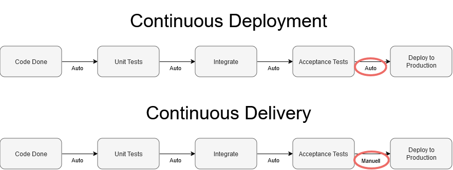
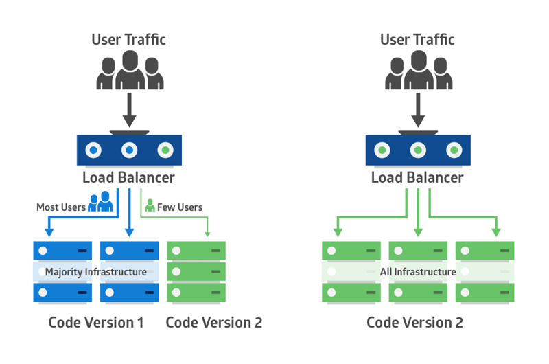
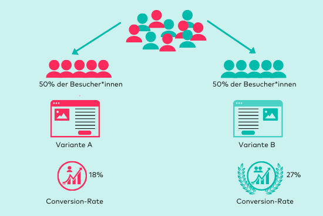
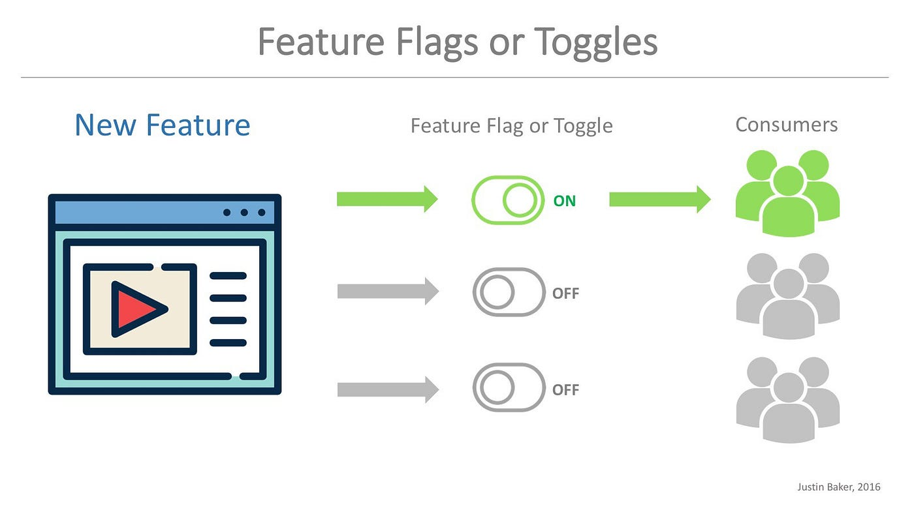

# Continuous Deployment

Continuous Deployment (CD) ist ein Softwareentwicklungsansatz, bei dem Codeänderungen automatisch und ohne manuelle Eingriffe in die Produktionsumgebung überführt werden. Dies ermöglicht es, neue Funktionen, Fehlerbehebungen und Updates schnell und effizient bereitzustellen.

## Was ist Continuous Deployment und wie wird es umgesetzt?
Continuous Deployment (CD) ist eine Praktik im Bereich DevOps, bei der jede Codeänderung, die die automatisierten Tests erfolgreich durchläuft, automatisch bis in die Produktionsumgebung bereitgestellt wird. Es entfernt manuelle Eingriffe und reduziert die Zeitspanne zwischen Codeerstellung und Bereitstellung erheblich.

### Praktischer Ablauf
1. Codeänderungen werden in ein Versionskontrollsystem (z. B. Git) gepusht.
2. Automatisierte Tests werden durch CI/CD-Pipelines durchgeführt (z. B. in Jenkins oder GitHub Actions).
3. Erfolgreich getestete Änderungen werden automatisch bereitgestellt, meist mit Tools wie Kubernetes, Helm oder Terraform.
4. Continuous Monitoring stellt sicher, dass Deployments stabil sind.

### Wichtige Aspekte bei der Nutzung
- Tests sind entscheidend: Automatisierte Tests müssen umfassend und robust sein, da jede fehlerhafte Änderung automatisch bereitgestellt wird.
- Monitoring: Deployment ohne Überwachung birgt das Risiko, Fehler nicht rechtzeitig zu erkennen.
- Rollback-Strategien: Ein fehlerhaftes Deployment sollte leicht zurückgesetzt werden können.

### Beispiele aus der Praxis
- Netflix: Führt über 100 Deployments pro Tag durch, gestützt auf CD-Methoden.
- Facebook: Nutzt CD für die kontinuierliche Bereitstellung kleiner Codeänderungen.

## Was ist der Unterschied zwischen Continuous Deployment und Continuous Delivery?

### Wichtige Aspekte bei der Nutzung

- Anwendungsfall: Continuous Delivery ist sinnvoll, wenn regulatorische Anforderungen oder manuelle Überprüfungen nötig sind. Continuous Deployment eignet sich besser für dynamische, schnelllebige Produkte.
- Teamkultur: CD (in beiden Varianten) erfordert Vertrauen in automatisierte Prozesse und eine enge Zusammenarbeit zwischen Entwicklern und Operations.

## Was sind die Vor- und Nachteile von Continuous Delivery und Continuous Deployment?

|                        | Vorteile                                                                            | Nachteile                                                                         |
|------------------------|------------------------------------------------------------------------------------|---------------------------------------------------------------------------------|
| **Continuous Delivery**| Ermöglicht menschliche Kontrolle vor dem Deployment in die Produktion.           | Verzögerung durch manuelle Schritte.                                          |
|                        | Geringeres Risiko durch manuelle Überprüfung.                                    | Potenzielle Engpässe durch menschliche Eingriffe.                             |
| **Continuous Deployment**| Schnellere Bereitstellung von Updates.                                         | Höheres Risiko, wenn Bugs in die Produktion gelangen.                         |
|                        | Minimierung menschlicher Fehler durch Automatisierung.                          | Erfordert sehr umfangreiche Tests, um Produktionsfehler zu vermeiden.        |

## Was sind die folgenden Deployment Strategien und wie werden sie umgesetzt?

### Blue/Green Deployment
Blue/Green Deployment ist eine Methode, bei der zwei Umgebungen existieren: eine aktive Produktionsumgebung ("Blue") und eine neue Version ("Green"). Nutzer werden nach und nach von der alten auf die neue Version umgeleitet.

#### Umsetzung
1. Zwei identische Umgebungen werden eingerichtet.
2. Der Traffic wird von der alten Umgebung auf die neue umgeleitet.
3. Bei Problemen kann einfach zurückgeschaltet werden.

#### Wichtige Aspekte bei der Nutzung
- Erfordert doppelte Infrastruktur, was Kosten erhöhen kann.
- Ermöglicht einfaches Rollback.

### Canary Deployment
Canary Deployment bezeichnet das schrittweise Ausrollen neuer Software auf eine kleine Benutzergruppe, bevor sie vollständig bereitgestellt wird.

#### Umsetzung
1. Eine kleine Gruppe erhält Zugriff auf die neue Version.
2. Feedback und Metriken werden gesammelt.
3. Bei Erfolg wird die neue Version für alle Nutzer ausgerollt.

#### Wichtige Aspekte bei der Nutzung
- Ideal für risikoarme Tests in der Produktion.
- Erfordert Kontrolle über Traffic (z. B. durch Load Balancer).

## Was ist A/B Testing?
A/B Testing ist eine Methode, um zwei Versionen eines Produkts (A und B) zu testen, indem sie unterschiedlichen Benutzergruppen gezeigt werden. Ziel ist es, zu analysieren, welche Version bessere Ergebnisse liefert.

### Wichtige Aspekte bei der Nutzung
- Erfordert sorgfältige Zieldefinition.
- Statistische Signifikanz ist entscheidend. ??? --> was heisst das

### Beispiele aus der Praxis
- Optimizely: Plattform für A/B Testing
- Amazon & YouTube: Führen ständige A/B Tests für Produktseiten durch ??? --> genaues bsp.

## Was sind Feature Toggles?
Feature Toggles erlauben die Aktivierung/Deaktivierung von Funktionen ohne erneutes Deployment.

### Wichtige Aspekte bei der Nutzung
- Erfordert Dokumentation, um "versteckte" Funktionen zu verwalten.
- Zu viele ungenutzte Feature Toggles können technischen Schulden verursachen.

## Was sind Rollback Strategien?
Rollback-Strategien ermöglichen das Zurücksetzen fehlerhafter Deployments. Dies ist eine Art "Safety Net", für wenn unvorgesehene Probleme auftreten.

### Umsetzung
- Datenbank-Snapshots: Speichern und Wiederherstellen des DB-Zustands.
- Versionskontrolle: Bereitstellen vorheriger Versionen aus Git.

### Wichtige Aspekte bei der Nutzung
- Für jede Deployment-Strategie sollte ein Rollback geplant werden
- Rollbacks automatisieren wo möglich

## Was ist Continuous Monitoring und wie wird es umgesetzt?
Continuous Monitoring überwacht Systeme, um Fehler oder Performance-Probleme frühzeitig zu erkennen.

## Wie werden Passwörter sicher gespeichert?

## Welche Arten von Deployment gibt es? Geben Sie alle Ihre Ideen an. Sie müssen dann nicht alle umsetzen, aber finden Sie heraus was alles möglich ist (z.B. Container via Docker, Container via Docker swarm, Direkt auf Server code kompilieren, etc). geben Sie dabei jeweils auch an, welche Software/Umgebung dazu notwendig ist.

# Quellen
- [Atlassian CD (19.11.2024)](https://www.atlassian.com/continuous-delivery/software-testing/continuous-deployment)
- [Wikipedia Feature Toggle (19.11.2024)](https://de.wikipedia.org/wiki/Feature_Toggle)
