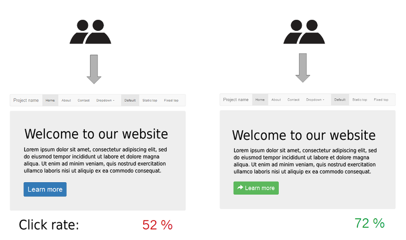
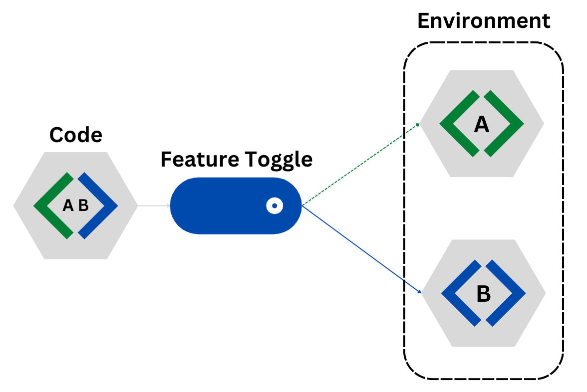
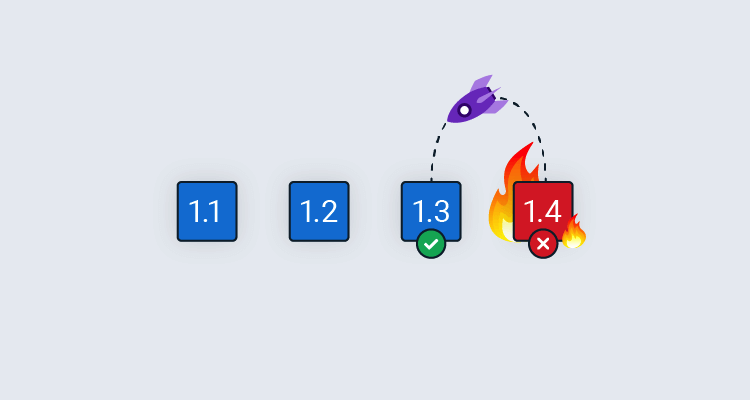

# Continuous Deployment

Continuous Deployment (CD) ist ein moderner Softwareentwicklungsansatz, bei dem Codeänderungen automatisch und ohne manuelle Eingriffe in die Produktionsumgebung überführt werden. Dieses Vorgehen verkürzt den Release-Zyklus drastisch und ermöglicht es Teams, kontinuierlich neue Funktionen, Fehlerbehebungen und Updates schnell und effizient bereitzustellen.

## Was ist Continuous Deployment und wie wird es umgesetzt?

Continuous Deployment ist eine Kernpraktik des **DevOps**-Ansatzes. Der Hauptunterschied zu herkömmlichen Deployment-Methoden liegt in der hohen Automatisierung: Sobald Entwickler Codeänderungen vornehmen, durchlaufen diese eine Reihe automatisierter Tests. Wenn alle Tests erfolgreich sind, wird der neue Code automatisch in die Produktionsumgebung ausgerollt.

### Praktischer Ablauf

1. **Code-Entwicklung und Versionskontrolle**

   - Entwickler schreiben Code und pushen die Änderungen in ein Versionskontrollsystem wie z.b. **Git** (z.B. GitHub, GitLab, Bitbucket).

2. **Continuous Integration (CI)**

   - CI/CD-Pipelines prüfen den Code auf Fehler und Kompatibilität:
     - **Unit-Tests** prüfen einzelne Komponenten.
     - **Integrationstests** überprüfen das Zusammenspiel mehrerer Module.
     - **Akzeptanztests** validieren die gesamte Anwendung.
   - Tools: Jenkins, GitHub Actions, GitLab CI/CD, CircleCI.

3. **Automatisiertes Deployment**

   - Nach erfolgreichem Testlauf wird der Code automatisch in die Produktionsumgebung deployed. Tools wie **Kubernetes**, **Docker Swarm** oder **Terraform** sind hier häufig im Einsatz.

4. **Monitoring**

   - Kontinuierliche Überwachung der Anwendung in Echtzeit. Tools wie **Prometheus**, **Grafana** oder **Datadog** helfen, Fehler schnell zu erkennen und die Performance zu optimieren.

### Wichtige Aspekte bei der Nutzung

- **Automatisierte Tests**: Die Qualität und Abdeckung der Tests sind entscheidend. Je umfangreicher die Tests, desto stabiler die Deployments.
- **Rollback-Strategien**: Im Falle eines Fehlers muss ein schnelles Zurückrollen auf die vorherige Version möglich sein.
- **Monitoring und Logging**: Echtzeitüberwachung und detaillierte Logs helfen bei der Fehlerdiagnose.
- **Sicherheit**: Sicherheitsprüfungen (z. B. Static Code Analysis) sollten ebenfalls automatisiert werden.

### Beispiele aus der Praxis

- **Netflix**: Führt täglich mehr als 100 Deployments durch. Dies ermöglicht es, neue Funktionen stufenweise zu testen und Fehler minimal zu halten.
- **Amazon**: Implementiert mehrere tausend Deployments pro Tag. Amazon nutzt CD, um Kunden schnellstmöglich Updates bereitzustellen und Fehler durch umfangreiche Monitoring-Tools zu minimieren.

---

## Was ist der Unterschied zwischen Continuous Deployment und Continuous Delivery?

Die Begriffe **Continuous Deployment** und **Continuous Delivery** werden oft verwechselt, haben aber klare Unterschiede:

- **Continuous Delivery**: Der Code wird automatisiert getestet und für das Deployment vorbereitet. Die **manuelle Freigabe** durch einen Menschen ist jedoch erforderlich, bevor der Code in Produktion geht.
- **Continuous Deployment**: Der gesamte Prozess ist **vollständig automatisiert**. Sobald Tests erfolgreich sind, wird der Code automatisch ausgerollt.

### Wann wähle ich welches Modell?

- **Continuous Delivery** eignet sich für regulierte Umgebungen oder sicherheitskritische Systeme, bei denen eine manuelle Prüfung vor dem Deployment notwendig ist.
- **Continuous Deployment** ist ideal für agile Unternehmen und dynamische Produkte, die ständige Updates benötigen.

### Vergleichstabelle

|                           | Vorteile                                               | Nachteile                                                     |
| ------------------------- | ------------------------------------------------------ | ------------------------------------------------------------- |
| **Continuous Delivery**   | Ermöglicht manuelle Kontrolle und Qualitätsprüfung.    | Zusätzliche Verzögerung durch manuelle Freigaben.             |
|                           | Reduziert Risiken durch menschliche Validierung.       | Langsamere Reaktionszeit bei Fehlern oder Updates.            |
| **Continuous Deployment** | Schnellere Updates, effizientere Entwicklungsprozesse. | Erfordert umfangreiche, zuverlässige automatisierte Tests.    |
|                           | Minimiert menschliche Fehler durch Automatisierung.    | Höheres Risiko, wenn fehlerhafter Code in Produktion gelangt. |

---

## Was sind die folgenden Deployment Strategien und wie werden sie umgesetzt?

### Blue/Green Deployment

**Blue/Green Deployment** beschreibt den Einsatz zweier identischer Umgebungen: Eine aktive Umgebung ("Blue") und eine inaktive Umgebung ("Green"), auf der die neue Version der Software ausgerollt wird.

#### Umsetzung

1. Beide Umgebungen werden vorbereitet und laufen parallel.
2. Der Traffic wird von der alten Umgebung (Blue) auf die neue Umgebung (Green) umgeleitet.
3. Tritt ein Problem auf, lässt sich der Traffic einfach zurück auf die Blue-Umgebung schalten.

#### Vorteile

- Minimiertes Risiko: Schnelles Rollback bei Fehlern.
- Keine Downtime während des Deployments.

#### Nachteile

- Höhere Kosten durch doppelte Infrastruktur.

---

### Canary Deployment

Beim **Canary Deployment** wird die neue Version schrittweise eingeführt. Zuerst erhalten nur wenige Nutzer Zugriff, um die Stabilität zu testen.

#### Umsetzung

1. Rollout der neuen Version für eine kleine Benutzergruppe (z.B. 5-10%).
2. Analyse von Feedback, Logs und Metriken.
3. Bei Erfolg wird der Rollout schrittweise für alle Nutzer erweitert.

#### Vorteile

- Risikominimierung: Probleme werden frühzeitig erkannt.
- Benutzerfreundlich: Kein kompletter Ausfall der Anwendung.

#### Nachteile

- Erfordert Monitoring und Traffic-Steuerung (z.B. durch Load Balancer).

---

## Was ist A/B Testing?

**A/B Testing** ist eine Methode, um zwei Versionen eines Produkts (Version A und Version B) zu vergleichen. Benutzer werden in Gruppen aufgeteilt, um zu testen, welche Variante bessere Ergebnisse liefert.

### Anwendung

- Zielsetzung: Definieren klarer Metriken wie Klickrate, Conversion oder Nutzerverhalten.
- Analyse: Statistisch signifikante Ergebnisse stellen sicher, dass der Vergleich zuverlässig ist.

### Beispiele aus der Praxis

- **Amazon**: Testet Produktseiten-Designs, um die Kaufwahrscheinlichkeit zu optimieren.
- **YouTube**: Experimentiert mit neuen UI-Elementen, um Nutzerbindung zu erhöhen.

---

## Was sind Feature Toggles?

**Feature Toggles** (auch Feature Flags genannt) erlauben es, bestimmte Funktionen in der Anwendung ein- oder auszuschalten, ohne ein erneutes Deployment durchführen zu müssen.

### Vorteile

- **Flexibilität**: Features können stufenweise eingeführt werden.
- **Rollback**: Einfaches Deaktivieren fehlerhafter Features.

### Herausforderungen

- **Verwaltung**: Zu viele ungenutzte Feature Toggles führen zu technischen Schulden.

---

## Was sind Rollback Strategien?

Rollback-Strategien sind essenziell, um im Fehlerfall schnell eine vorherige, stabile Version der Software wiederherzustellen.

### Methoden

- **Versionskontrolle**: Alte Releases werden aus dem Repository (z.B. Git) neu deployed.
- **Datenbank-Snapshots**: Speichern des aktuellen Zustands und Wiederherstellung bei Bedarf.

### Wichtig

- Automatisierte Rollbacks reduzieren die Fehleranfälligkeit.
- Regelmässiges Testen der Rollback-Prozesse ist notwendig.

---

## Was ist Continuous Monitoring und wie wird es umgesetzt?

**Continuous Monitoring** umfasst die kontinuierliche Überwachung der Software in Produktion, um Performance-Probleme, Fehler oder Sicherheitsrisiken frühzeitig zu erkennen.

### Tools

- **Prometheus** und **Grafana**: Echtzeit-Metriken.
- **Datadog**: Vollständige Monitoring-Lösungen für Infrastruktur und Anwendungen.

---

## Quellen

- [Atlassian CD (19.11.2024)](https://www.atlassian.com/continuous-delivery/software-testing/continuous-deployment)
- [Wikipedia Feature Toggle (19.11.2024)](https://de.wikipedia.org/wiki/Feature_Toggle)
